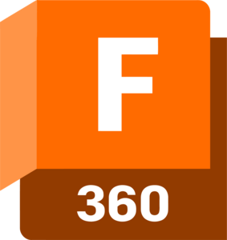

<a href="https://github.com/romainflcht/">
  <picture>
    
  </picture>
</a>

###

I'm Romain, 🧑🏻‍🎓 engineering student at ESME Sudria. 
Passionate about 💻 Computer science, ⚡ electronic, 🖨️ 3D printing.

###

## Languages

###

  
  
  

  

   

  

  

  

## Tools

###

  

  

  

  

## Contact

###

  

  

